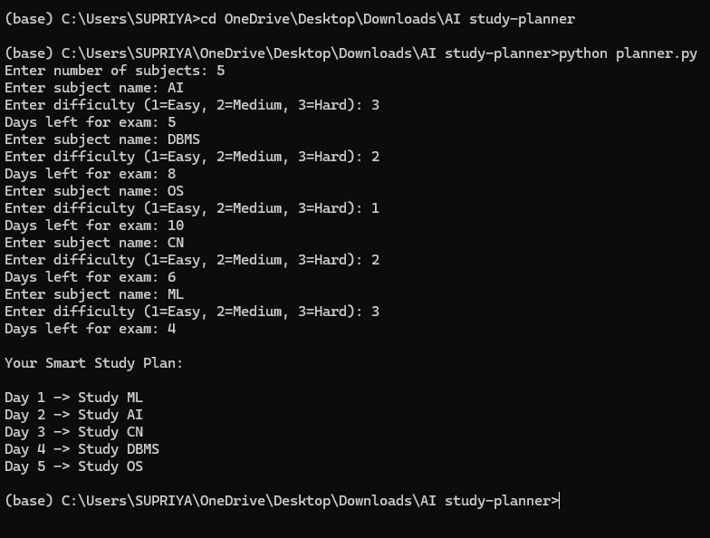

# AI Study Planner

## Project Overview

The AI Study Planner is a Python-based intelligent system that generates an optimized study schedule based on subject difficulty and exam deadlines. It helps students decide which subject to study first for efficient preparation.

## Problem Statement

Students often face difficulty deciding which subjects to study first during exam preparation. Without proper planning, time may be wasted on less important subjects. This project solves the problem by generating a prioritized study schedule using subject difficulty levels and remaining days before exams.

## Methodology

The system reads subject data from a dataset (dataset.csv) and calculates priority using the formula:

priority = difficulty / days_left

Subjects with higher priority scores are scheduled earlier in the study plan.

Steps followed in the project:

1. Read dataset from dataset.csv
2. Extract subject name, difficulty level, and days left
3. Calculate priority score
4. Sort subjects based on priority
5. Generate optimized study schedule

## Tools and Technologies Used

Python  
CSV Dataset  
Anaconda Prompt  
GitHub  

## Project Structure

README.md

dataset.csv

planner.py

study_plan_output.png

## How to Run the Project

Run the following command in Anaconda Prompt or terminal:

python planner.py

The program will generate a study schedule automatically based on dataset input.

## Dataset Used

Example dataset:

subject,difficulty,days_left
AI,3,5
DBMS,2,8
OS,1,10
CN,2,6
ML,3,4

## Sample Output

## Features

Reads subject data from CSV file  
Calculates priority automatically  
Generates optimized study schedule  
Simple and efficient implementation  
Easy to modify dataset  

## Conclusion

The AI Study Planner successfully generates a prioritized study schedule using subject difficulty and exam deadlines. This project demonstrates how simple AI-based logic can help students improve study planning and time management.

